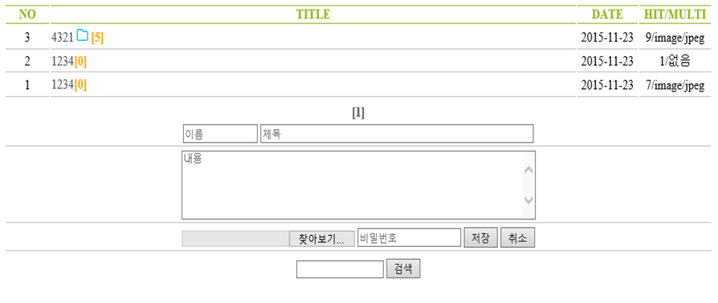
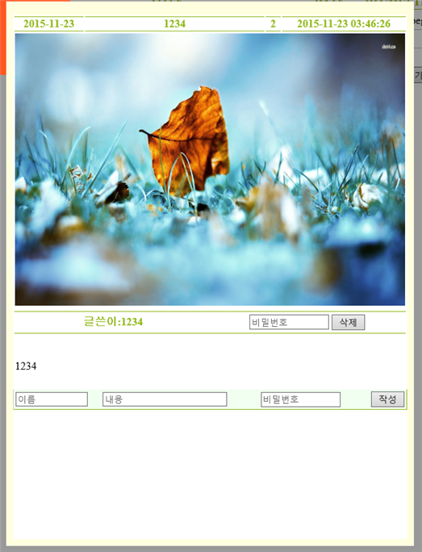
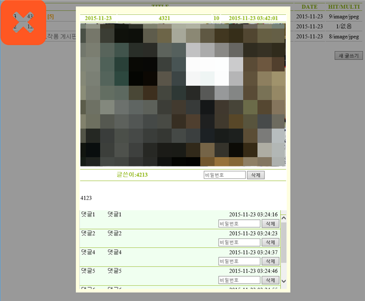
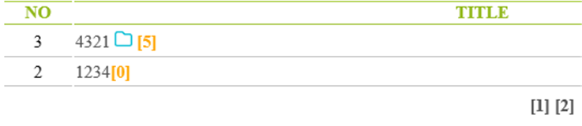
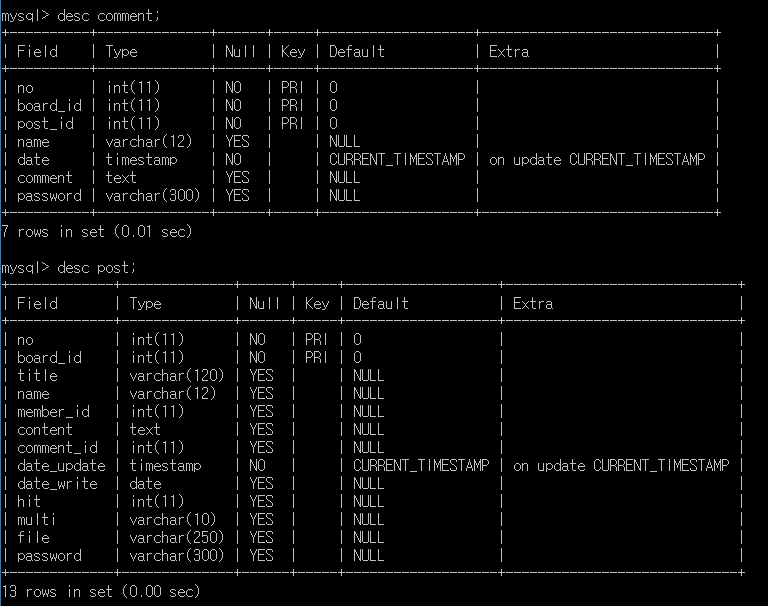

# Cappuccino Board

카프치노 게시판 :: 설치형 PHP 게시판



## Info

- 간단한 조작으로 게시판(+댓글) 기능이 있는 웹페이지를 구현할 수 있습니다.
  1. 글쓰기, 목록 보기, 게시글 내용보기, 파일 업로드

    

  2. 멀티미디어 구분하여 화면 출력하기 등 구현

    

  3. 화면에 표시할 게시글이 일정 개수만 표시
  4. 추가적인 부분은 다른 page로 표시

    

- PHP 및 데이터베이스가 되는 서버에서 사용가능합니다.
  - PHP 및 서버 세팅 방법은 [여기](https://blog.naver.com/cyydo96/220495625168)를 참조하세요.
- Database
  - 게시판 설치시 아래와 같이 여러 테이블을 생성합니다.
  - 구조
    
  - 설계(SQL)

    ```sql
    CREATE TABLE member_info (
        email varchar(150) primary key,
        name varchar(12),
        passowrd varchar(300),
        birth datetime,
        date timestamp
        );

    CREATE TABLE post (
        no int, board_id int,
        title varchar(120),
        name varchar(12),
        member_id int,
        content text,
        comment_id int,
        date_update timestamp,
        date_write date,
        hit int,
        multi varchar(10),
        file varchar(250),
        passowrd varchar(300),
        primary key (no,board_id)
        );

    CREATE TABLE comment (
        no int,
        board_id int,
        post_id int,
        name varchar(12),
        date timestamp,
        comment text,
        password varchar(300),
        primary key(no,board_id,post_id)
        );

    CREATE user 'boo'@'%' identified BY 'pboop';
    GRANT ALL PRIVILEGES ON boo.* TO 'boo'@'%' IDENTIFIED BY 'pboop';
    ```

## Finally

- 제로보드(XE), 그누보드와 같은 설치형 게시판을 만들고 싶어서 진행한 프로젝트입니다.
- PHP, HTML에 대해서 공부를 하면서 진행되었습니다.
- 파일 하나로 구현하여 페이지 이동이 거의 없도록 구현했습니다.

## Modify Content

- 2015.11.24.1821
  1. DB자동 설치 모드 추가
  2. 날짜 셋팅 추가

## Copyright

- 비상업적 용도로 사용 가능하며 `링크`를 반드시 포함해주세요.
- 문제가 되는 내용이 있다면 언제든지 [`issue`](https://github.com/Sotaneum/Cappuccino-Board/issues/new), [`Pull requests`](https://github.com/Sotaneum/Cappuccino-Board/compare) 부탁드립니다.
